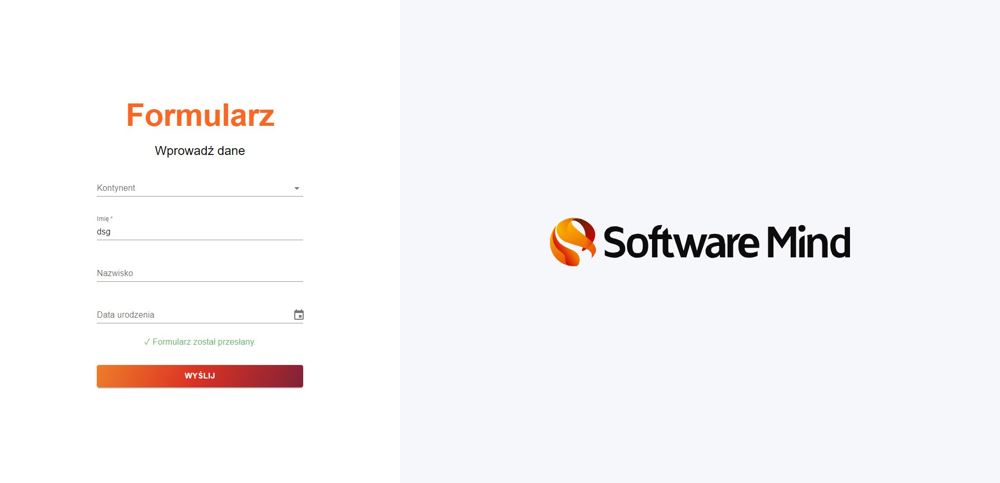
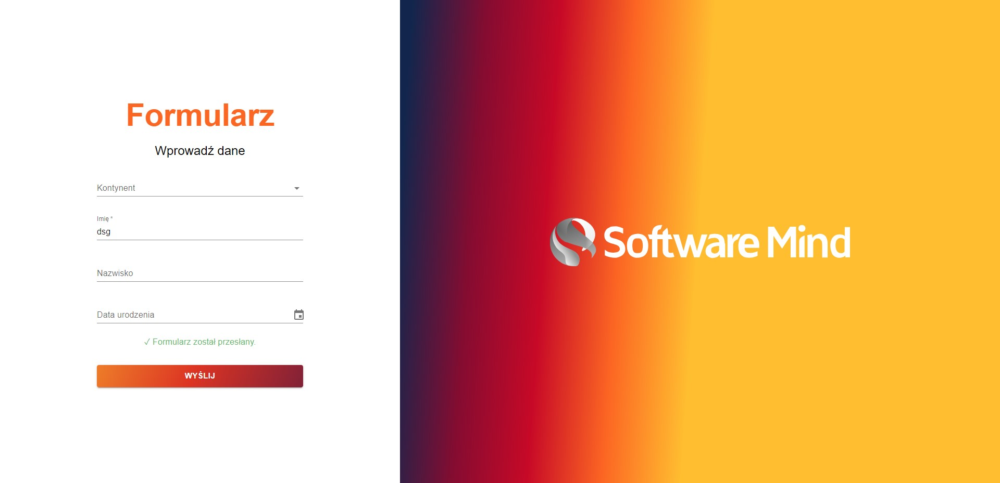

# Form Page

[](https://reactjs.org/)
[](https://www.typescriptlang.org/)
[](https://mui.com/)
[](https://react-hook-form.com/)
[](https://github.com/jquense/yup)

A simple, user-friendly and fully responsive website featuring a form built using React 18, TypeScript 5, MUI 5, React Hook Form 7, and Yup. This project consists of a form with four input fields (including a MUI datepicker) containing various validation rules. 

## Screenshots





## Table of Contents

- [Features](#features)
- [Installation](#installation)
- [Usage](#usage)

## Features

- A form with four input fields validated by various rules:
    - If a chosen continent is Europe, then the surname (if filled in) must have more than two characters.
    - A required name field.
    - Doubling the font size if user's age is above 60 years with edge case handling of a possibility to have a birthday today.
- Elegant hover on the logo.
- Disabling the submit button if validation rules are not met.
- After the initial submit, the validation is run onChange.
- Simulated two second loading with an animated loading icon after submitting the form.
- Success message displayed after the loading icon.

## Installation

To get started, clone the repository and install the dependencies:

```bash
git clone https://github.com/WoXuS/software-mind.git
cd software-mind
npm install
```

## Usage

To start the development server, run:
```bash
npm start
```

Open http://localhost:3000 to view the registration module in your browser.